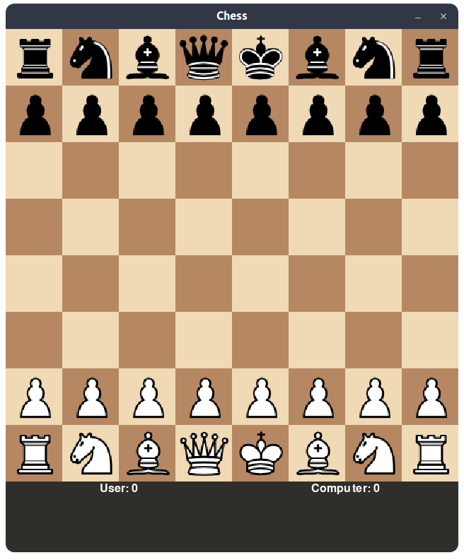

# Chess Game

## How to Run

Run the game using:

```bash
python chess.py
```

## Requirements

- Python 3.x
- `pygame` library

Install pygame:

```bash
pip install pygame
```

## How to Play

- The game opens a chess board.
- Click on a piece to select, then click on a destination square to move.
- The computer plays as Black, you play as White.
- Captured pieces and scores are shown below the board.

## Screenshot



## Algorithm Used

- Minimax algorithm for computer moves.
