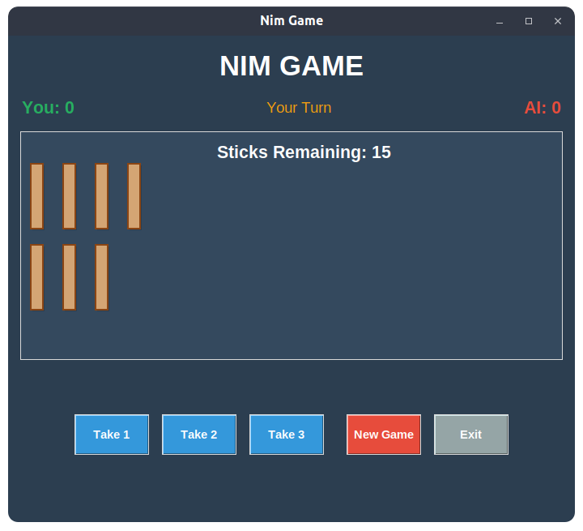

# Nim Game

## How to Run

Run the game using:

```bash
python nim.py
```

## Requirements

- Python 3.x
- `tkinter` (comes with standard Python)

## How to Play

- There are 15 sticks in a pile.
- On your turn, click a button to take 1, 2, or 3 sticks.
- The player forced to take the last stick loses.
- Scores are shown at the top.

## Screenshot



## Algorithm Used

- Optimal strategy for Nim (modulo 4 logic).
