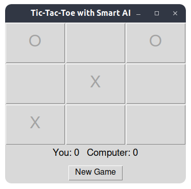

# Tic-Tac-Toe Game

## How to Run

Run the game using:

```bash
python tictactoe.py
```

## Requirements

- Python 3.x
- `tkinter` (comes with standard Python)

## How to Play

- You play as 'X', computer plays as 'O'.
- Click a cell to place your mark.
- The computer uses smart AI to play.
- Scores are shown below the board.
- Click "New Game" to restart.

## Screenshot



## Algorithm Used

- Minimax algorithm with alpha-beta pruning for computer moves.
