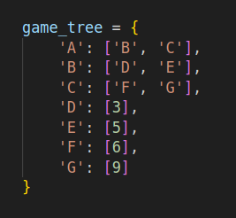
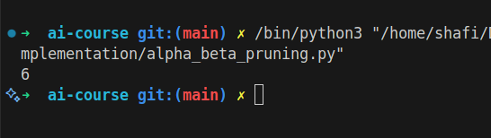

# Alpha-Beta Pruning

## How it Works

Alpha-Beta Pruning is an optimization technique for the minimax algorithm used in decision-making and game theory. It reduces the number of nodes evaluated in the search tree by pruning branches that cannot possibly influence the final decision, thus improving efficiency.

## Applications

- Two-player games (Chess, Tic-Tac-Toe)
- Game AI
- Decision-making systems

## Complexity

- Time Complexity: O(b^d) (same as minimax, but with fewer nodes)
- Space Complexity: O(bd)

## Images

