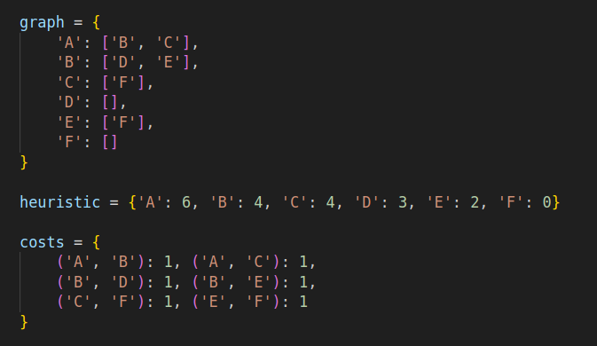
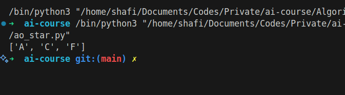

# AO\* Algorithm

## How it Works

AO\* (And-Or Star) algorithm is used for searching in AND-OR graphs, which represent problems with subproblems that can be solved independently (OR) or must be solved together (AND). It finds the optimal solution by expanding nodes and updating costs recursively.

## Applications

- Problem solving in AI
- Planning and reasoning
- Expert systems

## Complexity

- Time Complexity: Depends on graph structure, generally exponential in worst case
- Space Complexity: Depends on graph size

## Images

