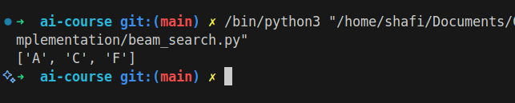

# Beam Search

## How it Works

Beam Search is a heuristic search algorithm that explores a graph by expanding the most promising nodes in a limited set (beam width). It is a trade-off between breadth-first and best-first search, keeping only a fixed number of best candidates at each level.

## Applications

- Natural Language Processing (NLP)
- Speech recognition
- Machine translation

## Complexity

- Time Complexity: O(bw \* d) (b: branching factor, w: beam width, d: depth)
- Space Complexity: O(bw \* d)

## Images

