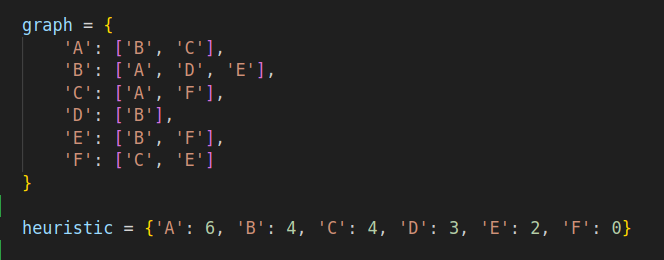
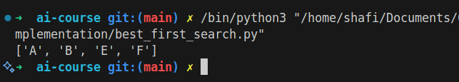

# Best First Search

## How it Works

Best First Search is a search algorithm that explores a graph by expanding the most promising node chosen according to a specified rule (usually a heuristic). It uses a priority queue to select nodes with the lowest cost or highest priority.

## Applications

- Pathfinding
- Puzzle solving
- AI planning

## Complexity

- Time Complexity: O(b^d) (b: branching factor, d: depth)
- Space Complexity: O(b^d)

## Images

