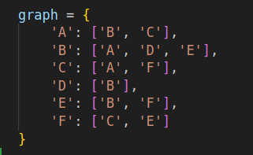
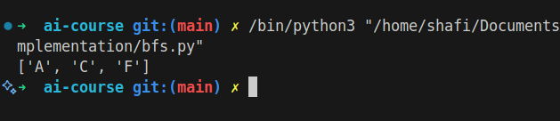

# Breadth-First Search (BFS)

## How it Works

BFS is a graph traversal algorithm that explores all neighbors at the current depth before moving to nodes at the next depth level. It uses a queue to keep track of nodes to visit.

## Applications

- Shortest path in unweighted graphs
- Web crawling
- Social network analysis

## Complexity

- Time Complexity: O(V + E) (V: vertices, E: edges)
- Space Complexity: O(V)

## Images

