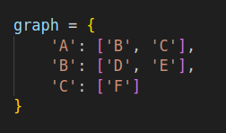
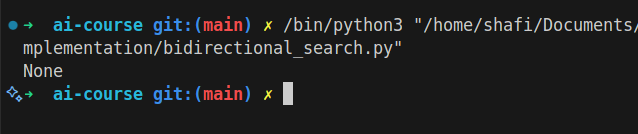

# Bidirectional Search

## How it Works

Bidirectional Search runs two simultaneous searches—one forward from the start node and one backward from the goal node—until they meet. This reduces the search space and improves efficiency.

## Applications

- Pathfinding in large graphs
- Route planning

## Complexity

- Time Complexity: O(b^{d/2}) (b: branching factor, d: depth)
- Space Complexity: O(b^{d/2})

## Images

