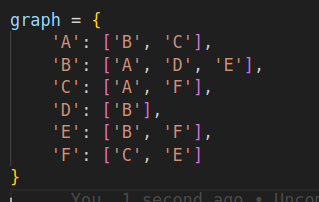
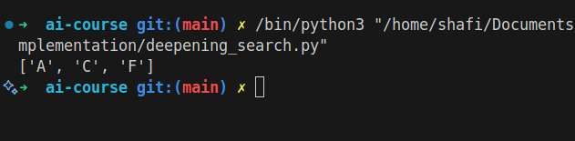

# Iterative Deepening Search

## How it Works

Iterative Deepening Search combines the benefits of depth-first and breadth-first search. It repeatedly applies depth-limited search with increasing limits until the goal is found.

## Applications

- Game tree search
- AI planning

## Complexity

- Time Complexity: O(b^d) (b: branching factor, d: depth)
- Space Complexity: O(d)

## Images

