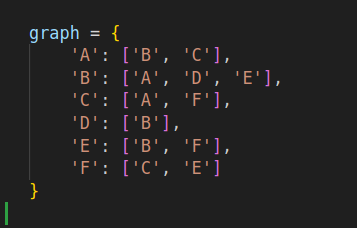
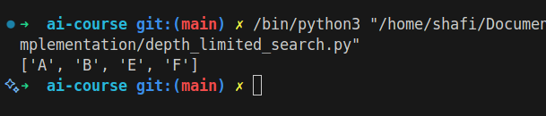

# Depth-Limited Search

## How it Works

Depth-Limited Search is a variant of depth-first search with a predetermined depth limit. It avoids infinite loops in cyclic graphs by not expanding nodes beyond the limit.

## Applications

- Game tree search
- Problem solving with depth constraints

## Complexity

- Time Complexity: O(b^l) (b: branching factor, l: depth limit)
- Space Complexity: O(l)

## Images

