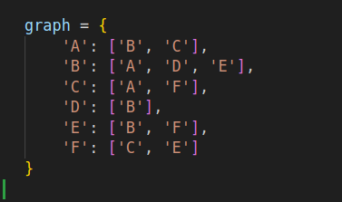
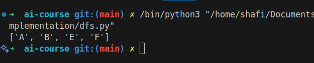

# Depth-First Search (DFS)

## How it Works

DFS is a graph traversal algorithm that explores as far as possible along each branch before backtracking. It uses a stack (explicit or via recursion) to keep track of nodes.

## Applications

- Topological sorting
- Cycle detection
- Maze solving

## Complexity

- Time Complexity: O(V + E) (V: vertices, E: edges)
- Space Complexity: O(V)

## Images

