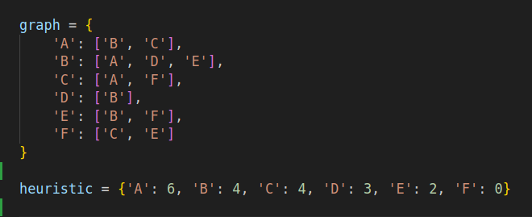
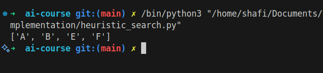

# Heuristic Search

## How it Works

Heuristic Search uses domain-specific knowledge (heuristics) to guide the search process towards the goal more efficiently. Examples include A\* and Greedy Best-First Search.

## Applications

- Pathfinding
- Game AI
- Optimization problems

## Complexity

- Time Complexity: Depends on heuristic; A\* is O(E)
- Space Complexity: O(V)

## Images

