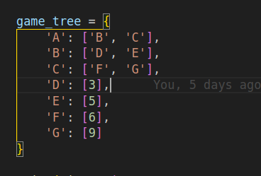
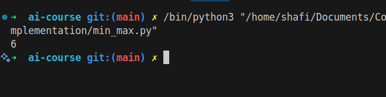

# Min-Max Algorithm

## How it Works

Min-Max is a recursive algorithm used in decision-making and game theory. It simulates all possible moves, assuming both players play optimally, and chooses the move that maximizes the minimum gain.

## Applications

- Two-player games (Chess, Tic-Tac-Toe)
- Game AI

## Complexity

- Time Complexity: O(b^d) (b: branching factor, d: depth)
- Space Complexity: O(bd)

## Images

